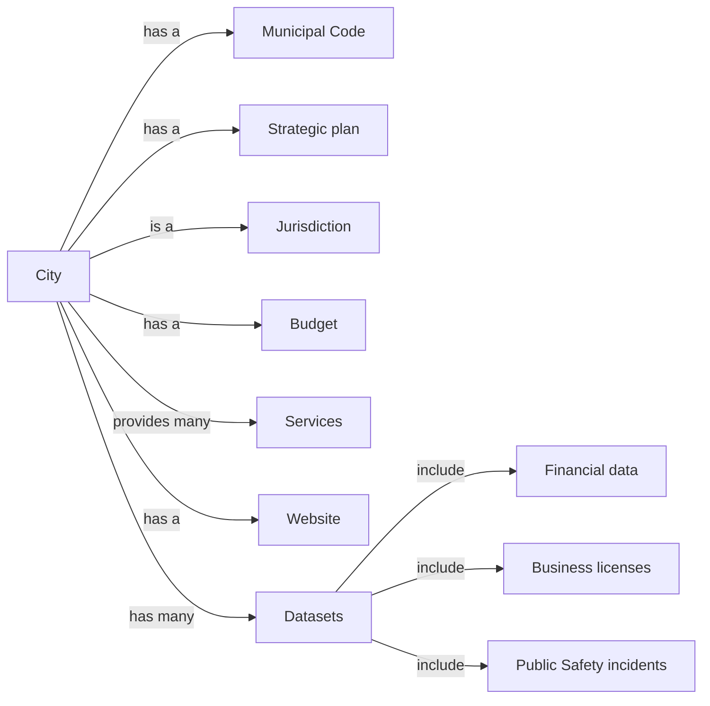

### City ontology

```mermaid

graph LR

  MC[Municipal Code]
  SP[Strategic plan]
  FD[Financial data]
  BL[Business licenses]
  PSI[Public Safety incidents]

  City --> |is a | Jurisdiction
  City --> |has a | Budget
  City --> |has a | SP
  City --> | provides many | Services
  City --> | has a | MC
  City --> | has a | Website
  City --> | has many | Datasets

  Datasets --> |include| FD
  Datasets --> |include| BL
  Datasets --> |include| PSI

```
