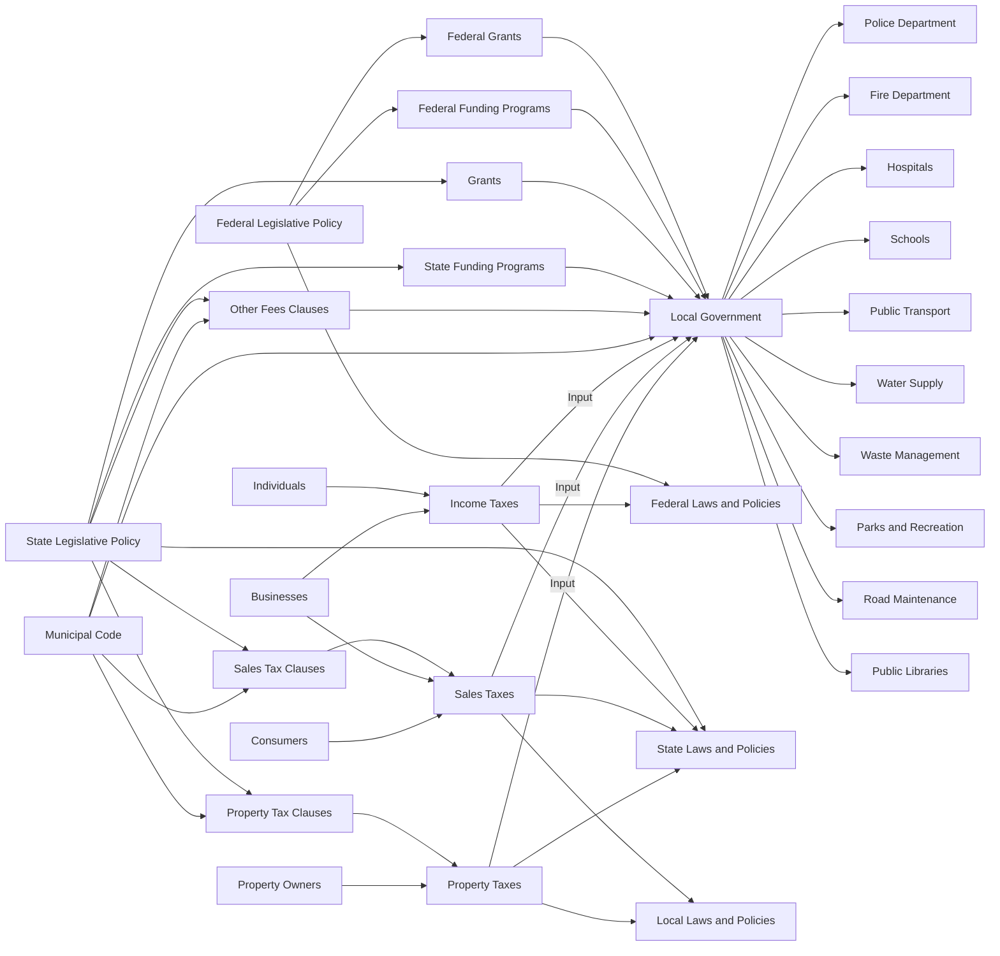

## Public infrastructure

```mermaid

graph LR
    A[Local Government]
    B[Police Department]
    C[Fire Department]
    D[Hospitals]
    E[Schools]
    F[Public Transport]
    G[Water Supply]
    H[Waste Management]
    I[Parks and Recreation]
    J[Road Maintenance]
    K[Public Libraries]
    L[Property Taxes]
    M[Sales Taxes]
    N[Income Taxes]
    O[Property Owners]
    P[Consumers]
    Q[Businesses]
    R[Individuals]
    S[Federal Laws and Policies]
    T[State Laws and Policies]
    U[Local Laws and Policies]
    V[Municipal Code]
    W[Property Tax Clauses]
    X[Sales Tax Clauses]
    Y[Other Fees Clauses]
    Z[State Legislative Policy]
    AA[State Funding Programs]
    AB[Grants]
    AC[Federal Legislative Policy]
    AD[Federal Funding Programs]
    AE[Federal Grants]

    A --> B
    A --> C
    A --> D
    A --> E
    A --> F
    A --> G
    A --> H
    A --> I
    A --> J
    A --> K
    L -->|Input| A
    M -->|Input| A
    N -->|Input| A
    O --> L
    P --> M
    Q --> M
    Q --> N
    R --> N
    L --> T
    L --> U
    M --> T
    M --> U
    N --> S
    N --> T
    V --> A
    V --> W
    V --> X
    V --> Y
    W --> L
    X --> M
    Y --> A
    Z --> T
    Z --> W
    Z --> X
    Z --> Y
    Z --> AA
    Z --> AB
    AA --> A
    AB --> A
    AC --> S
    AC --> AD
    AC --> AE
    AD --> A
    AE --> A


```